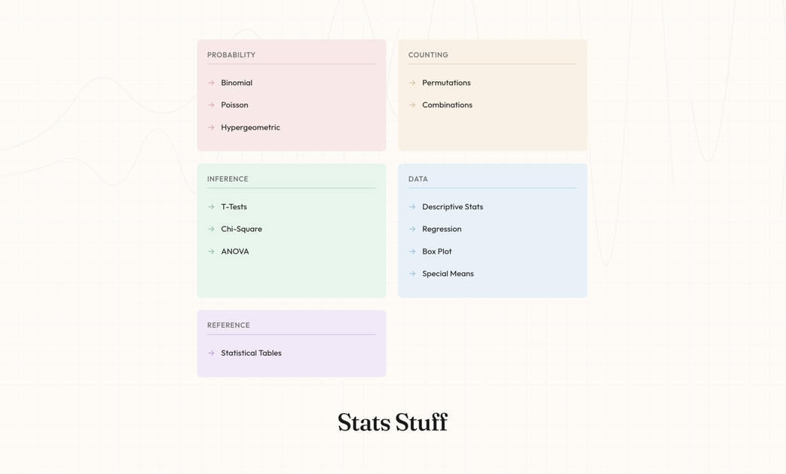

<p align="center">
  
</p>


<p align="center">
  <strong>Free statistical calculators with step-by-step solutions</strong>
</p>

<p align="center">
  <a href="https://stats-stuff.vercel.app">
    
  </a>
</p>

<p align="center">
  
  
  
  
  
</p>

---

## Features

| Category | Calculators |
|----------|-------------|
| **Probability** | Binomial, Poisson, Hypergeometric |
| **Counting** | Permutations, Combinations |
| **Inference** | T-Tests, Chi-Square, One-Way & Two-Way ANOVA |
| **Data** | Descriptive Stats, Regression, Box Plot, Special Means |
| **Reference** | Statistical Tables (Z, T, Chi-Square, F) |

- Step-by-step calculations with formulas
- Clean, minimal UI with pastel theming
- Mobile responsive

## Quick Start

```bash
# Install dependencies
npm install

# Start dev server
npm run dev
```

Open [http://localhost:5173](http://localhost:5173)

## Scripts

| Command | Description |
|---------|-------------|
| `npm run dev` | Start development server |
| `npm run build` | Production build |
| `npm run typecheck` | TypeScript type checking |
| `npm run test` | Run Vitest tests |

## Tech Stack

- **Framework**: React Router v7 (Remix-style)
- **Build**: Vite
- **Styling**: Tailwind CSS v4
- **Math Rendering**: KaTeX
- **Deployment**: Vercel

